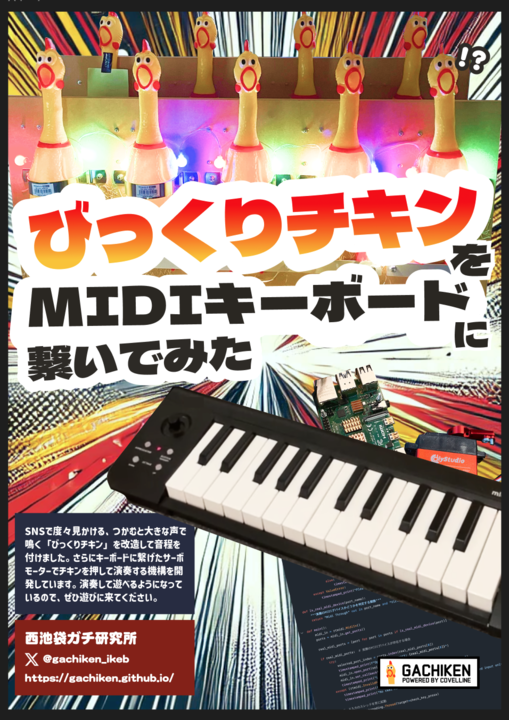

# 概要

[NT東京2024](https://nt-tokyo.org/)に出展した[びっくりチキンをMIDIキーボードに繋いでみた](https://nt-tokyo.org/exhibitors/113)のMIDI入力を受け取りサーボを動かすコード

[main.py](./main.py)がほぼ全てです。 
必要なライブラリは[requirements.txt](./requirements.txt)をみてください。

必要なもの

- ラズパイ
- usb接続できるmidiキーボード
- サーボ(TD-8125MG)
- サーボドライバ(PCA9685)

## 出展内容

https://togetter.com/li/2430765

# 使い方

[ここを参照](./doc/howtouse.md)

# 参考にした記事(thank you!!)

ボリュームを使ってサーボモータSG90を0～180°回す【テスター測定】
https://fujimoostudios.org/?p=204